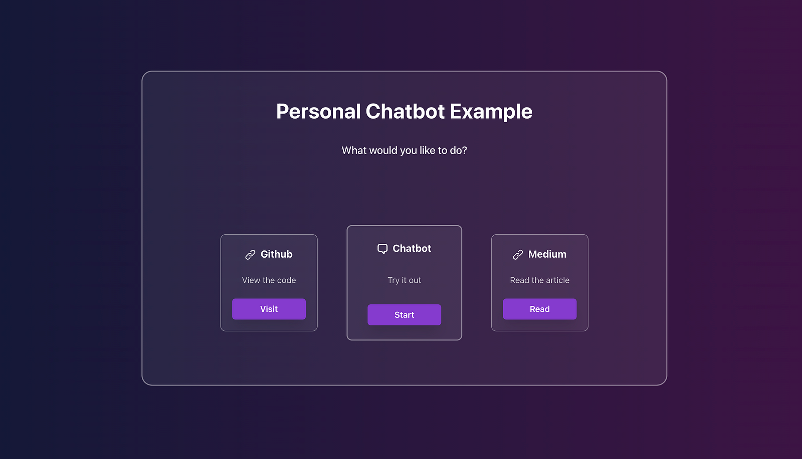

# PERSONAL CHATBOT



## Getting up and running

Get the server & the web running then visit http://localhost:3000

```bash
cd server
follow the read me
```

```bash
cd web
follow the read me
```

## Project Code

[github url](https://github.com/gary-george/personal_chatbot)

## Article

[medium url](https://garygeorge84.medium.com/build-a-personal-ai-chatbot-with-node-langchain-typescript-react-7a71c4648ea4)
